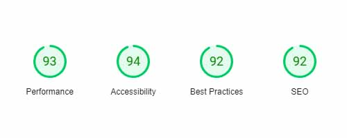
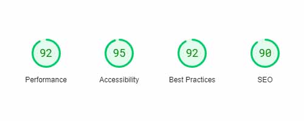
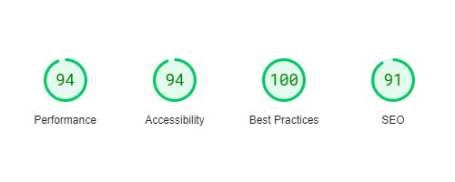
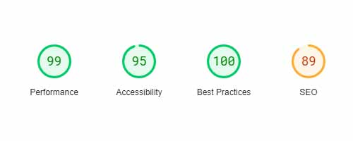
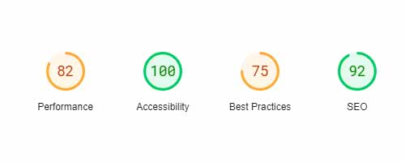
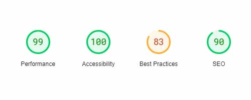
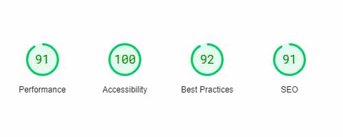
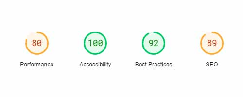

# **Web Dev 1 Final Project**

This is a website for a fictional arcade called "Arcadian Dreams"

There are three different pages which were created to show off the skills acquired through the first 12 weeks of the web development program with Code Kentucky.

Three  features were requried for this project the ones chosen are as follows:

- Responsive menu using javascript
- Animation on hover
- Accordion Display using Javascript

Optional features added

- Insights +80 
- Responsive image using JavaScript on Booking Page

 
 
 

## Page 1 (Landing page/Splash Page)
------------------------------------

**This page is the inital page that you are presented with and has the following items:**
 

- Responsive menu using Javascript
- Responsive cards using Grid as a layout method
- A contact page, with embeded Google map

All items on this page direct to either one of the other pages or the contact information at the bottom.
 
 
 
Mobile Score 
 
Desktop Score 
 
 

## Page 2 (Booking Information)
-------------------------------

**This page is a form used for booking the private rooms and has the following features:**
 

- Layout of the page is fully responsive to moblie or desktop, with the form moving from horizontal to vertical depending on device
- Javascript used to adjust background image based on which room is selected from drop down in form, this is also fully responisive to Mobile and Desktop
- Animation active around form while user hovers within the element
- HTML Form validation used to make sure that items that are needed are filled out
 
 
 

Mobile Score 
<<<<<<< HEAD

  
=======
 
>>>>>>> 58c01757ed5d615d011ee6eee07339bd1b9e8539
Desktop Score 
 
 

## Page 3 (Game Information)
----------------------------

**This page displays all of the games that are available in the arcade:**
 

- Full accordian drop down of the game lists using Javascript
- Each panel is fully responsive to both Mobile and Desktop
 
 
 

Mobile Score 
 
Desktop Score 
 
 

## Page 4 (High Scores)
------------------------

**This page displays the highscores that have been collected and displayed.**
 

- Fully responive layout for both Moblie and Desktop.

 
Mobile Score 
 
Desktop Score 
 

